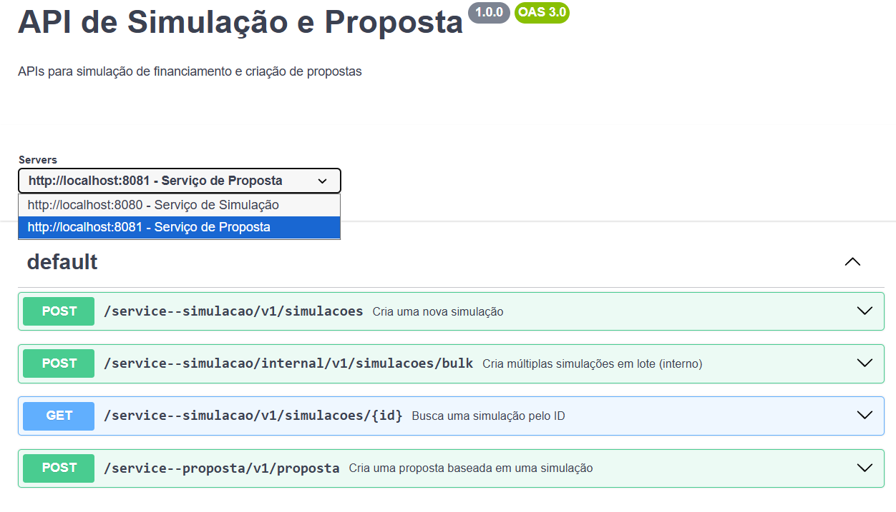
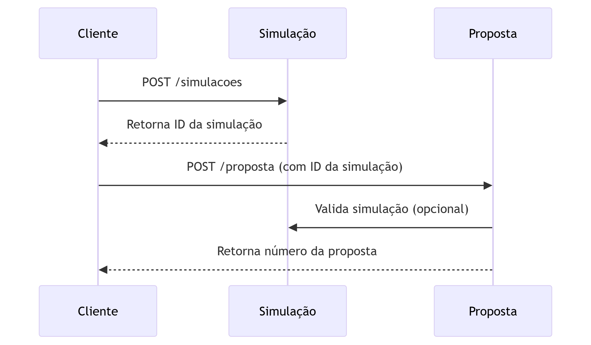

# API de Simulação e Proposta

## Visão Geral

Este projeto consiste em dois serviços principais: Simulação e Proposta, que trabalham em conjunto para fornecer funcionalidades de simulação de financiamento e criação de propostas.

## Documentação da API

### Endpoints de Simulação

#### POST /service--simulacao/v1/simulacoes

Cria uma nova simulação de financiamento.

Request Body:

json

`{`  
  `"valor": 10000.00,`  
  `"dataNascimento": "1995-05-15",`  
  `"prazoMeses": 120,`  
  `"registrar": true,`  
  `"modalidade": "VARIAVEL"`  
`}`

Response:

json

`{`  
  `"id": "68a439e6eb78fa8c509cbf6d"`  
`}`

#### POST /service--simulacao/internal/v1/simulacoes/bulk

Cria múltiplas simulações em lote (endpoint interno).

Request Body:

json

`{`  
  `"canalOrigem": "APP",`  
  `"correlationId": "UUID-4",`  
  `"simulacoes": [`  
    `{`  
      `"valor": 7129.94,`  
      `"prazoMeses": 32,`  
      `"dataNascimento": "1962-02-13",`  
      `"modalidade": "VARIAVEL",`  
      `"registrar": true`  
    `}`  
    `// ... mais simulações`  
  `]`  
`}`

#### GET /service--simulacao/v1/simulacoes/{id}

Busca uma simulação pelo ID.

### Endpoints de Proposta

#### POST /service--proposta/v1/proposta

Cria uma proposta baseada em uma simulação.

Request Body:

json

`{`  
  `"idSimulacao": "68a439e6eb78fa8c509cbf6d",`  
  `"cliente": {`  
    `"cpf": "12345678900",`  
    `"nome": "Fulano da Silva"`  
  `}`  
`}`

Response:

json

`{`  
  `"numeroProposta": "PROP20230001"`  
`}`

## Diagramas

### Diagrama de Sequência \- Fluxo de Simulação e Proposta

### Diagrama de Arquitetura

## Como Executar

### Pré-requisitos

* Java 11 ou superior  
* Maven 3.6+  
* Docker (opcional)

### Executando os Serviços

1. Serviço de Simulação

bash

`cd service-simulacao`  
`mvn spring-boot:run`

2. Serviço de Proposta

bash

`cd service-proposta`  
`mvn spring-boot:run`

### Executando com Docker

bash

`docker-compose up -d`

## Testando a API

Importe a collection do Postman fornecida e execute os requests na seguinte ordem:

1. `simulacao` \- Para criar uma simulação  
2. `buscar id` \- Para buscar a simulação criada  
3. `proposta` \- Para criar uma proposta baseada na simulação

## TODO \- Melhorias e Pendências

### Testes

* Implementar testes unitários para todos os serviços  
* Adicionar testes de integração entre os serviços  
* Criar testes de carga para o endpoint bulk  
* Implementar testes de contrato (Contract Testing)

### Validações

* Adicionar validações robustas nos DTOs de entrada  
* Implementar tratamento de erros padronizado  
* Criar validação de CPF no serviço de proposta  
* Adicionar validação de idade mínima para simulação

### Segurança

* Implementar autenticação JWT  
* Adicionar autorização baseada em roles  
* Configurar rate limiting para endpoints públicos  
* Implementar rate limiting específico para o endpoint bulk  
* Adicionar criptografia para dados sensíveis

### Observabilidade

* Configurar logs estruturados (JSON)  
* Adicionar métricas com Prometheus  
* Implementar tracing distribuído com Jaeger  
* Criar dashboards no Grafana para monitoramento  
* Configurar alertas para erros e performance

### Performance

* Implementar cache para consultas frequentes  
* Adicionar paginação para endpoints de listagem  
* Otimizar consultas ao banco de dados  
* Configurar connection pooling

### Resiliência

* Implementar padrão de retry para comunicação entre serviços  
* Adicionar circuit breaker para dependências externas  
* Configurar fallbacks para serviços dependentes  
* Implementar filas para processamento assíncrono

### Documentação

* Adicionar documentação de códigos de erro  
* Criar exemplos de payload para todos os endpoints  
* Documentar limites e quotas da API  
* Adicionar documentação de deployment

### DevOps

* Configurar CI/CD pipeline  
* Adicionar health checks para os serviços  
* Configurar monitoramento de recursos (CPU, memória)  
* Adicionar auto-scaling para os serviços