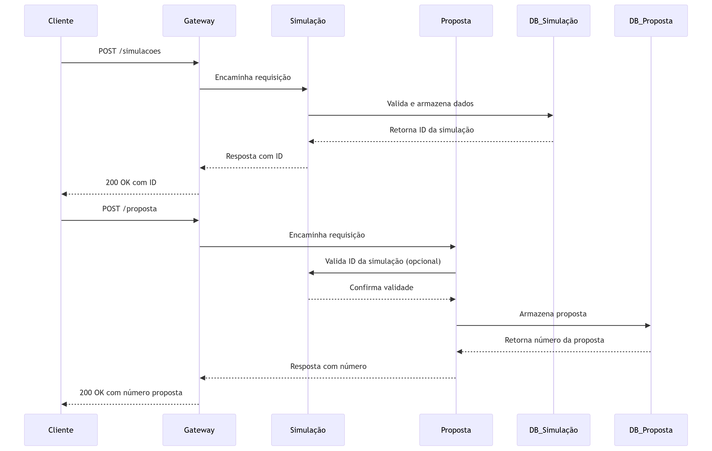
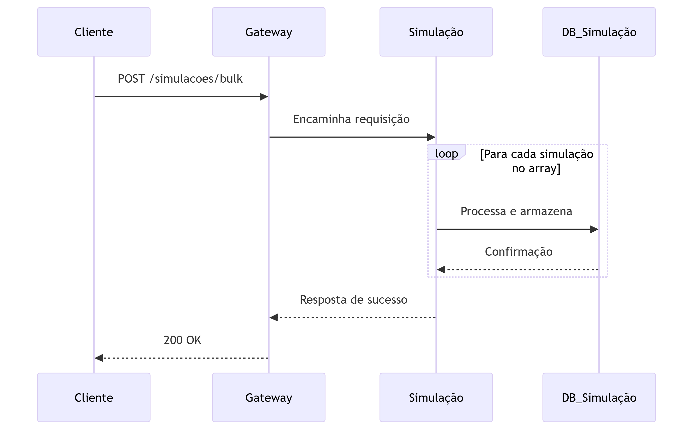
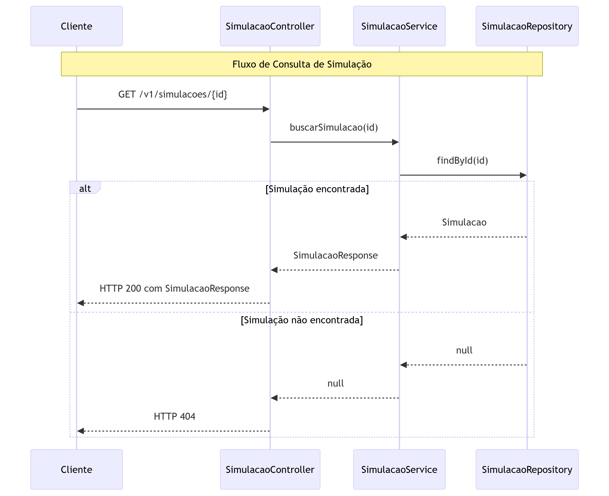
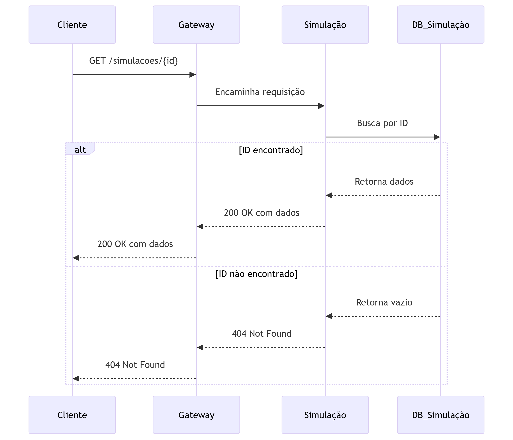
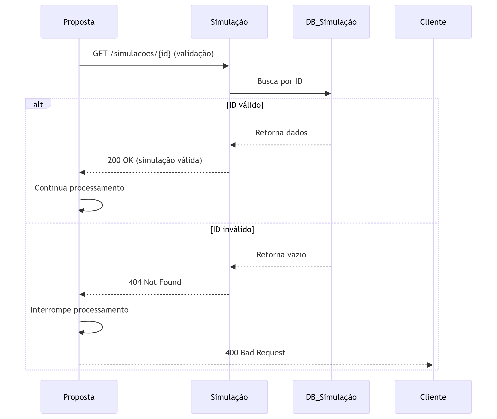
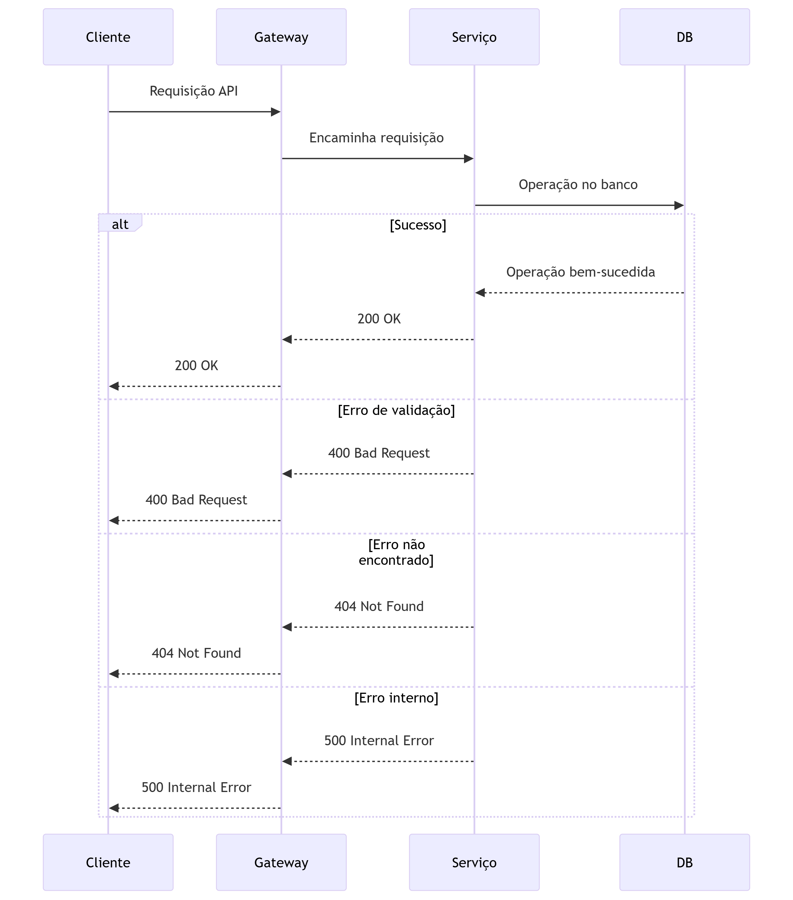

# Fluxos e Diagramas de Sequência \- API de Simulação e Proposta

## Fluxo Principal: Criação de Simulação e Proposta

### Fluxo Rest para uma proposta

### Fluxo Rest para multiplas proposta

## Fluxo de Simulação em Lote (Bulk)

### Diagrama de Sequência

### Diagrama de Sequência para Fluxo Kafka - Parte 1: Recebimento e Divisão

### Diagrama de Sequência para Fluxo Kafka - Parte 2: Processamento e Agregação

## Fluxo de Consulta de Simulação

### Diagrama de Sequência

## Fluxo de Validação entre Serviços

### Diagrama de Sequência

## Fluxo de Tratamento de Erros

### Diagrama de Sequência

Estes diagramas representam os principais fluxos da aplicação, mostrando as interações entre os diferentes componentes do sistema e os possíveis caminhos de processamento para cada operação.  
